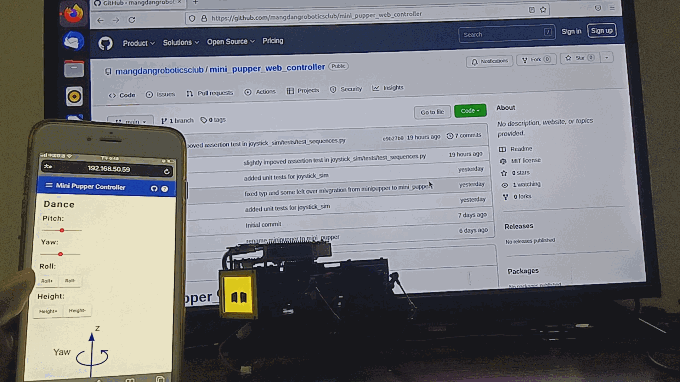

# mini_pupper_web_controller

Web GUI that can be run on a mobile devices, such as smartphone, Pad, Notebook that can run a browser.



## Installation

Step1: install [mini_pupper_bsp](https://github.com/mangdangroboticsclub/mini_pupper_bsp.git)  repo and run the test script to ensure your installation works as expected.

Step2: install [mini_pupper](https://github.com/mangdangroboticsclub/StanfordQuadruped.git)  repo.

After the up installation, please follow the below steps.

```
cd ~
git clone https://github.com/mangdangroboticsclub/mini_pupper_web_controller.git
./mini_pupper_web_controller/webserver/install.sh
```

It also install a pygame based keyborad controller that you might find usefull in certain circumstances
```
cd ~
sudo apt-get install -y libsdl2-2.0-0
sudo pip3 install pygame
git clone https://github.com/stanfordroboticsclub/PupperKeyboardController.git
```

## Run
Point a web browser to http://x.x.x.x:8080 where x.x.x.x is the IP address of your mini_pupper
