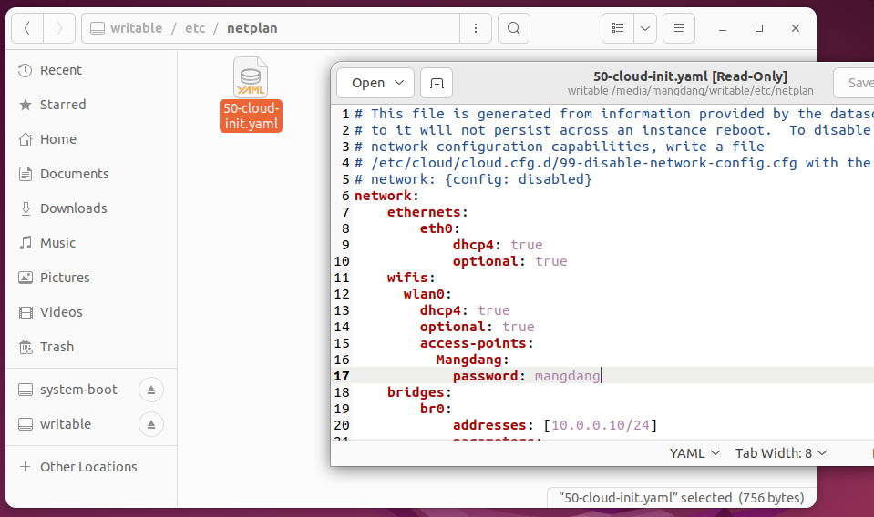

# Summary

[](https://youtu.be/ubgNV3DJ6JE)   

You can try this application on Mini Pupper and Mini Pupper2. 

Web GUI that can be run on mobile devices, such as smartphones, Pad, and Notebook can run a browser.


## Installation

Step 1: Install the BSP((board support package) repo for your [Mini Pupper 2](https://github.com/mangdangroboticsclub/mini_pupper_2_bsp) or [Mini Pupper](https://github.com/mangdangroboticsclub/mini_pupper_bsp.git).

Step 2: Install [StanfordQuadruped](https://github.com/mangdangroboticsclub/StanfordQuadruped)  repo.

Step 3: Install this repo.

```
cd ~
git clone https://github.com/mangdangroboticsclub/mini_pupper_web_controller.git
./mini_pupper_web_controller/webserver/install.sh
```

## Run

### Make sure Mini Pupper can get IP address

Use your own WiFi AP name and password to replace the default value in "/etc/netplan/50-cloud-init.yaml" 

You can use the SD card to boot the system, then edit line 16, 17 in "/etc/netplan/50-cloud-init.yaml", or 

You put the SD card into the SD reader and plug it into a Ubuntu PC, and then edit 50-cloud-init.yaml, just as shown in the below picture, 



and then run the command "sudo netplan apply" or reboot Mini Pupper, and then the IP address should be shown on the screen.


### Use a web browser to control 

- Point a web browser to http://x.x.x.x:8080 where x.x.x.x is the IP address of your mini_pupper, such as, http://192.168.5.196:8080
- Click the “Activate” button of the "Controller" tab. 
- Click the “Activate/Deactivate” button of the "Pupper" tab.
- Click the "≡" icon at the top left corner.
- Choose the "Walk" option.
- Click the "Walk/Rest" button.
- Use the scroll bar to control your Mini Pupper


## Keyboard controller
If you want to use a keyboard to control Mini Pupper, please try the below steps. Be certain to tell ssh to allow X11 forwarding before you run it.

```bash
ssh -o ForwardX11=yes ubuntu@<Your Mini Pupper IP address>
```

```
cd ~
sudo apt-get install -y libsdl2-2.0-0
sudo pip3 install pygame
git clone https://github.com/mangdangroboticsclub/PupperKeyboardController
python keyboard_joystick.py
```
